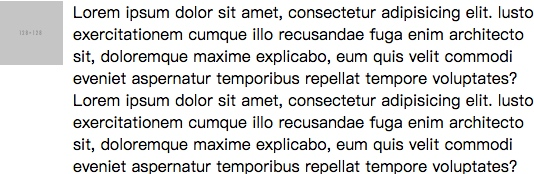
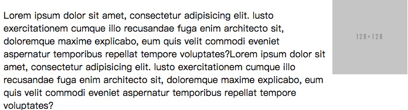

# 深入理解 Float

---

**班级事务**

* 开班满一个月了 - 总结文章可以有了（知乎，github 注册）
* 最佳学习进度 - P3
* 唯一班规 - 每两周的 15 分钟 1 对 1 必须参加
* 学会提问 - 新手最容易犯的错误

---

## Float 历史

Float 一开始设计的初衷是：文字环绕效果，而并不是现在应用最多的各种布局。理解这个有助于理解 Float 的一些特性。

---

## 包裹与破坏

Float 包裹性，与 BFC（Block Formatting Context - 块级格式化上下文）息息相关。简单的来讲就是，Float 元素的子元素与外部隔绝，不会互相影响（布局）。

---

可以形成 BFC 的所有小伙伴：

* 根元素，即HTML元素
* float的值不为none
* overflow的值不为visible
* display的值为inline-block、table-cell、table-caption
* position的值为absolute或fixed或sticky

---

Float 破坏性，就是浮动元素会导致父元素高度塌陷的情况。

具有破坏性（高度塌陷）的其他小伙伴：

* display: none
* pisition: absolute/fixed/sticky

---

## 如何理解 Float 的破坏性

首先要知道 Float 导致的父元素高度塌陷不是一个 BUG，它就是标准。浮动的原始作用是做文字环绕效果，符合 Float 表现出来的特性。

可以这么理解，只有浮动后，高度塌陷，文字才能到达占领之前图片所在的高度，对图片环绕。实例分析：[Float 破坏性](https://codepen.io/ista/pen/GmwMvW)

---

## 清除 Float 对外部的影响

上面已经知道浮动元素会导致高度塌陷，且会向某个方向浮动，从而对周边元素产生影响，当我们只需要 Float 的浮动特性，而并不需要它的高度塌陷的特性，这个时候我们就需要清除浮动。

清除浮动通常有两种方法，一个 clear，一个 BFC/haslayout。

---

### clear 方法

1. HTML block 水平元素底部，加上清除浮动的 CSS

```html
<div class="clearfix"></div>
```

```css
.clearfix { clear: both; }
```

缺点：空的 div 标签，不符合语义，也不整洁

---

2. CSS after 伪元素底部生成

```css
.clearfix:after { clear: both; }
```

缺点：不兼容 IE6/7，现在已经不是缺点

---

### BFC/haslayout 方法

创建 BFC 容器，将浮动元素包裹，隔绝外部，互相不影响布局，这里可以使用除了 Float 之外的 BFC 实现方式。

---

### 最佳实践

权衡后的策略：

```css
.clearfix:after {
	content: '';
	display: block;
	height: 0;
	overflow: hidden;
	clear: both;
}

.clearfix {
	*zoom: 1;
}
```

---

更好更简洁的方法：

```css
.cleatfix:after {
	content: '';
	display: table;
	clear: both;
}

.clearfix {
	*zoom: 1;
}
```

`.clearfix` 应该应用在包含浮动子元素的父级元素上

查看实例：[清除浮动](https://codepen.io/ista/pen/QvJaOd)

## Float 的一些应用

除了我们已经知道的浮动特性：

* 浮动性
* 包裹性
* 高度塌陷

---

还有这两个表现：

* [浮动会去掉空格](https://codepen.io/ista/pen/EmOoJO)
* [浮动会让元素部分 block 化](https://codepen.io/ista/pen/vmQpqO)，具有盒子模型的特点，但是不一定占据整行

应用这些特性和表现，就可以帮助我们做出流体布局

---

### 手机页面导航栏

效果：


---

大概思路如下：

```css
float: left; //左青龙
float: right; //右白虎
text-align: center; //中间是标题
```

[演示](https://codepen.io/ista/pen/oWQEgv)

---

### 单侧固定

效果：



---

大概思路如下：

```css
width+float
padding-left/margin-left
```

[演示](https://codepen.io/ista/pen/BRGYjR)

---

### 单侧固定进阶

这里讲 DOM 与显示位置匹配的单侧固定布局，效果：



---

大概思路如下：

```css
width: 100% + float
	padding-left/margin-left
width + float + margin负值
```

[演示](https://codepen.io/ista/pen/VbVQza)

---

### 更多 Float 应用

第一次直播 Float 布局回顾：

上次直播讲了各种布局，其中就讲了用 Float 实现这几种布局：定宽与自适应，不定宽与自适应，等分，等高，也就是 Float 几乎可以实现我们常用的所有布局。具体查看 [CSS 多列布局](https://codepen.io/ista/pen/WjXjXJ)。

---

## 浮动的兼容性

IE6/7 浏览器中 Float 有很多令人费解奇怪的 BUG，好在如今这些浏览器已经淘汰，不必再讨论。

即使这样，浮动还是不要滥用，比如说可以用 inline-block 布局的不要用 Float，可以用 flex 布局的不要用 float。而文字环绕效果，是坚决要使用 Float，这就是它设计的初衷。

